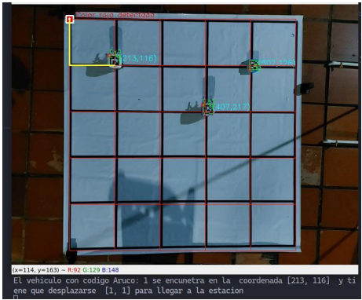
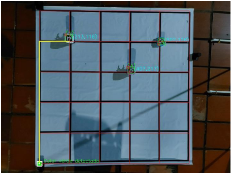
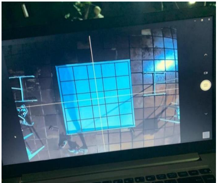

# Vehicle steering system

The designed steering system aims to guide a mobile object through a pre-established work space, sending through radio frequency signals the turns and intersections to cross to get from one point to another and return. This was possible through the joint work of a camera located perpendicularly over the work area and arc codes to successfully identify and differentiate objects.

We can see the route to be taken by the closest robot given a request

View of the master control computer
